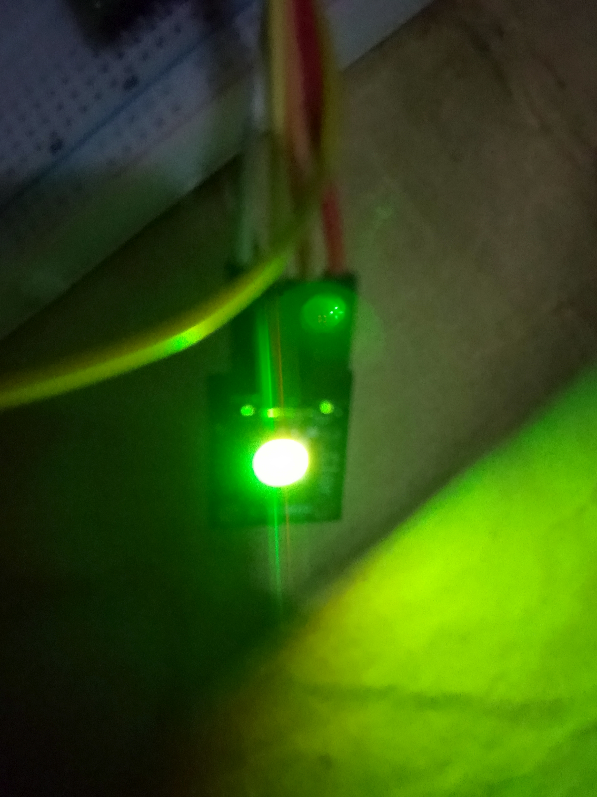

# Controlling an RGB LED with User Input on Raspberry Pi Pico W

This project demonstrates how to control an RGB LED using user input on the Raspberry Pi Pico W. The user enters a color name through the terminal, and the RGB LED displays the corresponding color by adjusting the red, green, and blue channels using PWM.

## Components Used

* Raspberry Pi Pico W
* RGB LED Module
* Breadboard
* Jumper Wires

## Programming Language

* MicroPython

## Features

* User-controlled color selection
* PWM-based RGB LED control
* Interactive terminal input
* Multiple predefined colors
* RGB color mixing

## Project code

[Click here to check out the project code](code/rgb_led_module_control_python_project.py)

## Project Images

## Project Demo video

[Click here to check out the project Demo Video](https://youtu.be/w-B5rr1O_60?si=qGGtGn0dHHeO7Qc0)

## Pin Connections

* Red Pin → GP13
* Green Pin → GP14
* Blue Pin → GP15

## How It Works

The program displays a list of available colors and prompts the user to enter a color name. Once a valid color is selected, the Raspberry Pi Pico W adjusts the brightness of the red, green, and blue channels of the RGB LED to produce the desired color.

Available colors:

* Red
* Green
* Blue
* White
* Pink

If an invalid color is entered, a default color is displayed.

## Author

Moses Olorunfemi Kolawole
